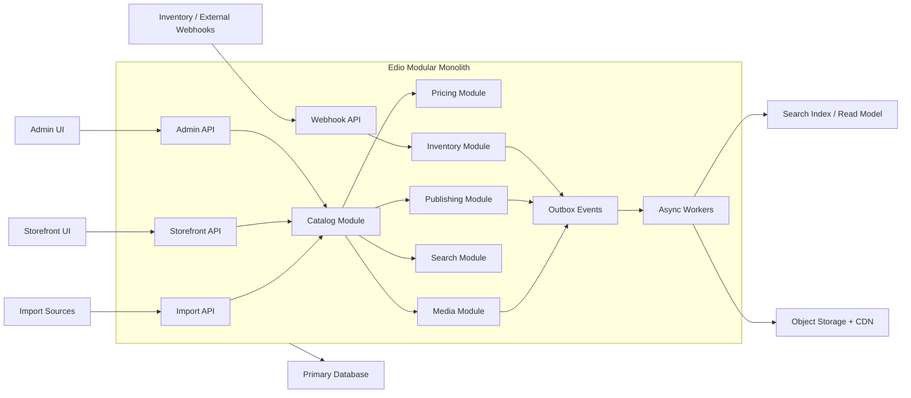
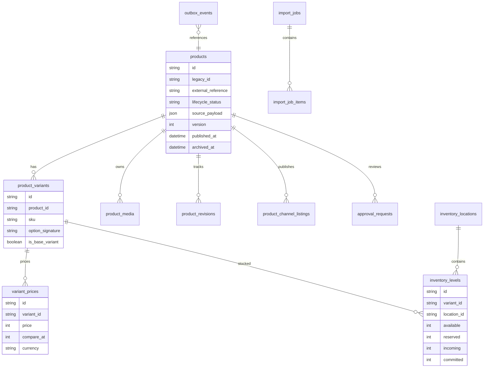
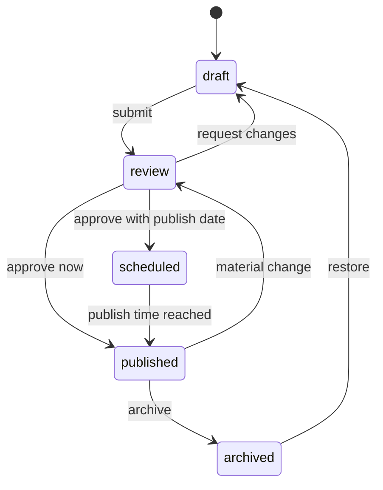
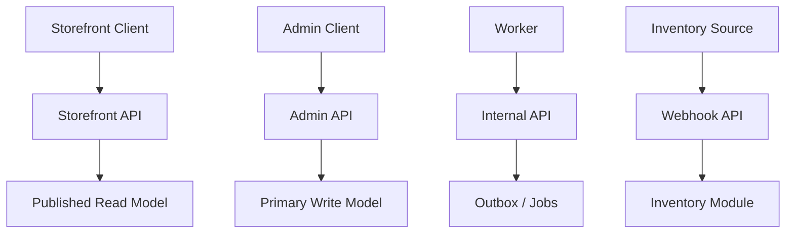
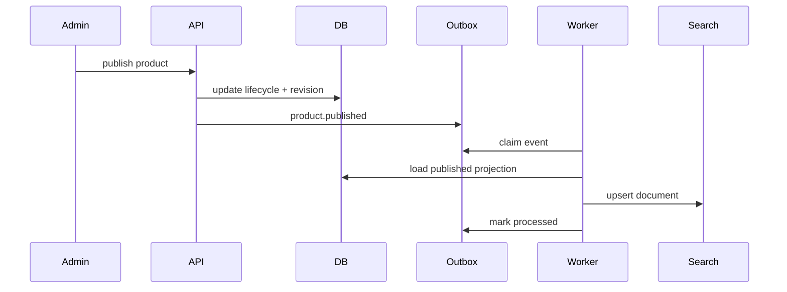
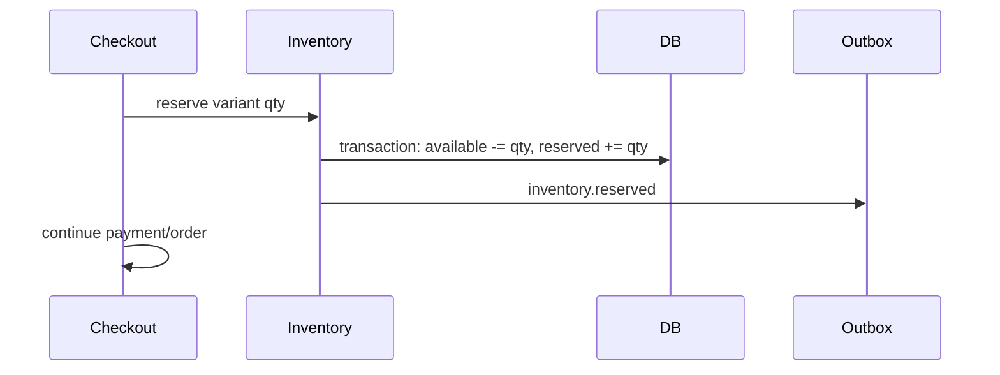
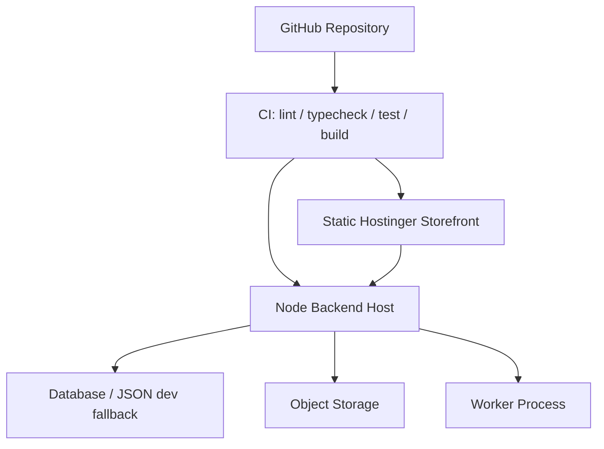
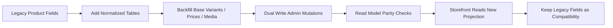

# Edio Backend Architecture Engineering Review RFC

Status: Draft for engineering review
Target system: Edio premium audio e-commerce platform
Primary constraint: no existing Edio feature may be removed. Backward compatibility must be preserved. All migrations must be additive-first.
Review scope: backend architecture, data model, publishing, search, media, inventory, security, deployment, observability, migration, and rollback controls.

## I. Executive Architecture Overview

### Problem It Solves
Edio needs a backend architecture that supports product import, media processing, pricing, inventory, publishing, admin workflows, search, and storefront delivery without breaking the current static storefront or existing admin flows.

### Design Choice
Use a modular monolith as the default production architecture, with explicit domain modules and an outbox-driven event layer. Keep current routes and product fields operational while adding normalized product, variant, media, inventory, publishing, and workflow tables beside the legacy model.

### Trade-Offs
The modular monolith gives strong local consistency for catalog writes and simpler deployment, while still allowing workers and external services to be split later. It is less independently scalable than microservices, but it avoids premature distributed-system complexity.

### Failure Modes
- Search index drift from failed outbox processing.
- Published storefront cache mismatch after product lifecycle changes.
- Inventory race conditions when webhook and admin edits arrive close together.
- Media derivative failures leaving products with only original images.

### Scaling Threshold
Keep the modular monolith until one of these thresholds is reached:
- Search indexing backlog exceeds 5 minutes during normal operations.
- Media processing consumes more than 30% of API CPU for sustained periods.
- Inventory write volume exceeds 20 writes/second or concurrent checkout reservations become common.
- Admin imports exceed 10,000 products/job or 100,000 media candidates/month.

### Edio-Specific Implementation Recommendation
Continue the current additive backend layer and formalize it as the production path. The static Hostinger deployment can keep using fallback catalog data, but any admin, import, auth, inventory, or publishing capability requires a Node-capable deployment target.

## II. Core Backend Architecture

### Problem It Solves
The platform must support rapid product operations and future growth without fragmenting into disconnected services.

### Design Choice
Adopt a modular monolith with event-driven boundaries. Modules share one database initially but communicate across domains through service interfaces and outbox events for asynchronous side effects.

Architecture options:
- Monolith: fastest initially, highest coupling.
- Modular monolith: best current fit, clear boundaries, simple deployment.
- Microservices: useful only after scaling pressure is proven.
- Event-driven services: useful for indexing, media derivatives, notifications, and revalidation.

### Trade-Offs
Modular monolith reduces operational overhead and keeps cross-module transactions possible. The cost is that module boundaries must be enforced by code review and tests rather than network isolation.

### Failure Modes
- Hidden coupling if modules import each other’s persistence internals.
- Long-running import or media jobs blocking API threads.
- Outbox records accumulating if workers are down.

### Scaling Threshold
Split a module into an external service only when it has independent load, independent failure characteristics, and a stable contract. First candidates are media processing, search indexing, and inventory reservations.

### Edio-Specific Implementation Recommendation
Use these module boundaries:
- `catalog`: products, variants, taxonomy, publishing metadata.
- `pricing`: variant prices, sale windows, currency policy.
- `inventory`: locations, levels, reservations, movements.
- `media`: assets, candidates, derivatives, hero selection.
- `search`: read model, facets, synonyms.
- `publishing`: lifecycle, revisions, approvals, storefront visibility.
- `admin-workflows`: bulk actions, review queues, audit logs.
- `outbox/jobs`: durable async work dispatch.

## III. Domain Model & Data Model

### Problem It Solves
The current product model is storefront-friendly but not sufficient for variant-first pricing, inventory, lifecycle, media provenance, or import review.

### Design Choice
Add normalized models beside current product records. Preserve existing fields as a compatibility layer.

### Trade-Offs
Normalized data improves correctness and workflow control. The trade-off is additional read composition and migration complexity.

### Failure Modes
- Legacy product fields and normalized variant records diverge.
- Products exist without base variant due to failed backfill.
- Price displayed from legacy field differs from variant price.
- Media row exists but asset URL is missing.

### Scaling Threshold
Move read-heavy storefront product composition into a materialized read model when PLP or search endpoints exceed 200ms p95 under normal traffic or product count exceeds 25,000.

### Edio-Specific Implementation Recommendation
Keep current `products` output contract intact. Backfill every existing product with:
- one base variant minimum
- one active price row
- default inventory location
- product media records from existing image/gallery
- channel listing for storefront
- lifecycle status mapped from existing status

## IV. Publishing & Workflow Engine

### Problem It Solves
Product edits, imports, pricing, media, and SEO should not become visible until review and publishing criteria are satisfied.

### Design Choice
Use an explicit lifecycle:

### Trade-Offs
Workflow adds operational safety but requires admins to understand draft/review/published states. It prevents accidental storefront changes at the cost of extra UI states.

### Failure Modes
- Product published without hero image or price.
- Scheduled publish job does not execute.
- Cache invalidation fails after publish.
- Admin edits a published product without revision tracking.

### Scaling Threshold
Introduce a dedicated workflow worker when scheduled jobs exceed 1,000/day or publish/revalidate events exceed 10/minute during imports.

### Edio-Specific Implementation Recommendation
Use approval requests and product revisions for all high-impact changes:
- title
- price
- inventory availability
- category
- hero image
- SEO metadata
- publish/unpublish/schedule

## V. API Design

### Problem It Solves
Storefront, admin, internal jobs, and webhooks have different consistency, authorization, and payload requirements.

### Design Choice
Split API contracts by audience:
- Storefront API: read-only, cacheable, published products only.
- Admin API: authenticated, RBAC-protected, full workflow.
- Internal API: token-protected operational actions.
- Webhooks: HMAC-verified external writes.

### Trade-Offs
Audience-based APIs reduce accidental data leakage and simplify caching rules. The trade-off is duplicated DTO mapping between admin and storefront responses.

### Failure Modes
- Admin-only fields leak into storefront responses.
- Webhook accepted without signature verification.
- Internal endpoint exposed without token in production.
- Storefront displays draft product through legacy fallback.

### Scaling Threshold
Add API gateway or edge routing when public traffic and admin traffic need separate rate limits, deployment cadence, or runtime locations.

### Edio-Specific Implementation Recommendation
Required additive endpoints:
- `GET /api/admin/products`
- `GET /api/admin/products/:id`
- `POST /api/admin/products/:id/publish`
- `POST /api/admin/products/:id/unpublish`
- `POST /api/admin/products/:id/schedule`
- `POST /api/admin/import/products`
- `POST /api/webhooks/inventory-updated`
- `POST /api/internal/revalidate`

## VI. Search & Indexing Architecture

### Problem It Solves
Search needs facets, Arabic/English synonyms, typo tolerance, and fast PLP filtering without coupling every query to transactional product tables.

### Design Choice
Maintain a search read model updated through outbox events. Use internal fallback search until indexing is complete.

### Trade-Offs
Eventual consistency improves search performance and resilience. The trade-off is short-lived index drift after writes.

### Failure Modes
- Product is published but missing from search index.
- Product is unpublished but still searchable.
- Facet counts drift from real catalog.
- Typo tolerance incorrectly matches SKU/barcode.

### Scaling Threshold
Externalize search to Meilisearch, Typesense, Algolia, or OpenSearch when product count exceeds 10,000, facet latency exceeds 150ms p95, or typo/synonym rules become business-critical.

### Edio-Specific Implementation Recommendation
Keep a local read model first. Index:
- product id/slug
- title Arabic/English
- brand
- category and secondary categories
- price
- availability
- dynamic collections
- search terms and synonyms

Disable typo tolerance for SKU, barcode, MPN, and exact model fields.

## VII. Media & Asset Pipeline

### Problem It Solves
Imported product images can be incomplete, duplicated, transparent on dark backgrounds, or unsuitable as hero images.

### Design Choice
Use a media pipeline with candidate ingestion, provenance, normalization, dedupe, scoring, derivatives, and product assignment.

### Trade-Offs
Async derivatives and hero scoring improve quality and speed. The trade-off is that a newly imported product may initially show a fallback image until processing finishes.

### Failure Modes
- Transparent PNG rendered on dark surface.
- Duplicate images fill gallery.
- Hero image selected from lifestyle or package image incorrectly.
- Derivative generation fails while original exists.
- CDN URL missing or stale.

### Scaling Threshold
Move media processing to a separate worker/service when average image processing time exceeds 2 seconds/item, CPU exceeds 30% of API host, or import jobs regularly contain more than 500 images.

### Edio-Specific Implementation Recommendation
Rules:
- Never overwrite original assets.
- Flatten transparent PNG onto `#FFFFFF`.
- Generate card, PDP, thumbnail, and gallery derivatives.
- Store provenance and hero confidence.
- Keep legacy `image` and `gallery` fields populated from selected media for storefront compatibility.

## VIII. Inventory & Reservation Model

### Problem It Solves
Stock display, checkout reservation, pre-owned quantity, and external inventory updates must remain consistent.

### Design Choice
Track inventory at variant + location level:
- available
- reserved
- incoming
- committed

Use strong consistency for checkout reservations and inventory decrements. Use eventual consistency for search and cached storefront availability.

### Trade-Offs
Strong reservation consistency prevents oversell. The trade-off is more complex checkout and transaction handling.

### Failure Modes
- Concurrent purchases oversell the last unit.
- Webhook overwrites a local reservation.
- Reservation expires but is not released.
- Pre-owned item duplicated without isolated stock.

### Scaling Threshold
Introduce a dedicated reservation service or database row-locking strategy when concurrent checkout traffic exceeds 5 reservations/second for the same SKUs or when multi-location fulfillment becomes active.

### Edio-Specific Implementation Recommendation
For current Edio:
- Preserve existing stock fields for storefront reads.
- Add compatibility sync from inventory levels to legacy product `stock`, `inStock`, and `availabilityStatus`.
- Treat pre-owned units as distinct variants or listings when condition matters.
- Require audit trail for every inventory movement.

## IX. Performance & Caching Strategy

### Problem It Solves
Storefront pages must be fast while product publishing, pricing, and inventory remain correct.

### Design Choice
Use separate caching levels:
- Static assets: long TTL with hashed filenames.
- Storefront product read model: short TTL or tag-based invalidation.
- Product detail: cache published projection.
- Admin APIs: no-store.
- Search: indexed read model.

### Trade-Offs
Caching improves performance but creates invalidation risk. Publishing and inventory changes require deterministic cache invalidation.

### Failure Modes
- Published product not visible due to stale cache.
- Unpublished product remains visible.
- Price changed in admin but old price shown.
- Inventory says in stock after sold out.

### Scaling Threshold
Add distributed cache when API read p95 exceeds 200ms or storefront traffic exceeds one Node instance. Use cache tags once deployment platform supports it.

### Edio-Specific Implementation Recommendation
For static Hostinger:
- Build-time fallback catalog remains acceptable for storefront-only mode.
- Admin-backed dynamic catalog requires Node deployment.
- Revalidation endpoint should queue outbox events even if static hosting cannot invalidate automatically.

## X. Security & Authorization Model

### Problem It Solves
Admin operations, customer accounts, import pipelines, and webhooks need least privilege and auditable access.

### Design Choice
Use RBAC and explicit guards:
- customer
- admin
- super_admin only if required

Use HttpOnly session cookies plus token support for compatibility. Sensitive actions require recent reauthentication.

### Trade-Offs
Strong authorization increases code paths and tests. It is necessary for admin safety and customer privacy.

### Failure Modes
- Customer accesses admin endpoint.
- Admin role escalation through profile update.
- Token or cookie accepted after logout.
- Webhook replay or forged signature.
- Secrets logged in audit events.

### Scaling Threshold
Adopt managed auth or dedicated identity service when social login, passkeys, mobile app sessions, and admin step-up policies become core revenue paths.

### Edio-Specific Implementation Recommendation
Required controls:
- server-side RBAC on every protected endpoint
- rate limits on auth and admin mutations
- HMAC verification for webhooks
- redaction of password, token, cookie, secret
- audit logs for login, publish, price change, inventory change, import, delete
- no role/status changes from self-profile endpoints

## XI. DevOps & Deployment Strategy

### Problem It Solves
Edio currently has a static deployment path, but backend features require a Node runtime, migrations, jobs, and secrets.

### Design Choice
Keep static deployment for storefront fallback, but deploy the backend to a Node-capable environment before enabling admin production features.

### Trade-Offs
Static hosting is cheap and fast, but cannot run API, auth, imports, or admin mutations. Node hosting increases operational work but unlocks backend capability.

### Failure Modes
- Static site points to unavailable API.
- Environment secrets missing.
- Worker not running, outbox backlog grows.
- Build deploys frontend incompatible with API version.

### Scaling Threshold
Move from JSON file storage to managed database before production admin usage. Move to separate worker process before heavy import/media usage.

### Edio-Specific Implementation Recommendation
CI must run:
- lint
- typecheck
- tests
- build

Production must define:
- `JWT_SECRET`
- `EDIO_DB_FILE` or database URL
- `EDIO_INVENTORY_WEBHOOK_SECRET`
- `EDIO_INTERNAL_REVALIDATE_TOKEN`
- storage/CDN credentials when media pipeline becomes active

## XII. Observability & Monitoring

### Problem It Solves
Admin operations and async pipelines must be traceable when products, prices, search, media, or inventory drift.

### Design Choice
Use structured logs, correlation IDs, audit events, and operational dashboards.

### Trade-Offs
More observability creates additional storage and privacy obligations. Redaction is mandatory.

### Failure Modes
- Import failure cannot be traced to source URL.
- Inventory drift detected by customers first.
- Search index is stale without alert.
- Publish action has no actor trail.

### Scaling Threshold
Add external log aggregation when production traffic starts or when more than one backend/worker process exists.

### Edio-Specific Implementation Recommendation
Track:
- PDP latency
- PLP latency
- search latency
- publish success/failure
- outbox backlog age
- media processing failure rate
- inventory drift count
- admin mutation audit count
- login failure rate

## XIII. Migration Strategy for Edio

### Problem It Solves
Edio has existing products, routes, admin screens, fallback catalog data, and deployment constraints. Migration must not break any of them.

### Design Choice
Use additive-first migration:
1. Add new collections/tables.
2. Backfill from legacy products.
3. Dual-read with legacy fallback.
4. Dual-write for admin mutations.
5. Validate parity.
6. Switch reads to normalized model.
7. Keep legacy compatibility fields until all clients are migrated.

### Trade-Offs
Dual-write and compatibility mapping create temporary complexity. They prevent breaking storefront and admin flows.

### Failure Modes
- Backfill partially completes.
- Dual-write writes legacy but not normalized fields.
- New projection changes product sorting unexpectedly.
- Imported WordPress taxonomy relationships are lost.

### Scaling Threshold
Run migrations in batches when product count exceeds 10,000 or media candidates exceed 50,000.

### Edio-Specific Implementation Recommendation
Hard requirements:
- No existing feature removed.
- No existing route removed.
- No existing UI flow broken.
- Every product must keep current slug and URL.
- Every migration must be reversible or safe to rerun.
- Low-confidence classification or media decisions must enter review, not auto-publish.

## XIV. Scaling Limits & Failure Modes

### Problem It Solves
The system needs explicit operating limits so scaling decisions are made before outages.

### Design Choice
Define thresholds and mitigation paths for each subsystem.

### Trade-Offs
Explicit limits require monitoring. Without monitoring, the limits are documentation only.

### Failure Modes and Mitigation
- Search index drift: compare published product count to indexed count; replay outbox.
- Inventory race condition: enforce transactional reservation; reject stale webhook version.
- Publish cache mismatch: tag invalidation plus read-after-write smoke check.
- Media backlog: queue priority for hero images; fallback to original image.
- Import job crash: resumable job items with idempotency keys.
- Admin bulk action error: preview first; transaction where possible; audit every mutation.

### Scaling Threshold
Split components when their failure domain must be isolated:
- Search worker: backlog older than 5 minutes.
- Media worker: p95 processing > 5 seconds/item.
- Inventory service: frequent same-SKU concurrent reservations.
- Database: JSON file storage used by more than one production process.

### Edio-Specific Implementation Recommendation
Current Edio should prioritize:
1. Node backend deployment.
2. Managed database.
3. Outbox worker.
4. Media object storage.
5. Search index.

## XV. Anti-Patterns to Avoid

### Problem It Solves
Prevents architecture drift and regression as features are added.

### Design Choice
Codify banned patterns.

### Trade-Offs
Strict rules reduce quick hacks but improve long-term maintainability.

### Failure Modes
If ignored:
- product data becomes inconsistent
- admin actions become unsafe
- storefront becomes stale
- SEO data becomes unreliable
- imports create unreviewable catalog noise

### Scaling Threshold
Any repeated manual repair of the same data class is a signal to automate validation or workflow gates.

### Edio-Specific Implementation Recommendation
Avoid:
- creating top-level categories automatically
- storing price only on product when variants exist
- publishing low-confidence imports
- making media processing synchronous in request path
- bypassing outbox for search updates
- deleting legacy fields before clients are migrated
- allowing admin UI-only authorization
- using webhook data without signature verification
- showing draft products in storefront structured data

## XV-A. E-Commerce Backend Anti-Patterns in Growing Systems

This section defines common backend failure patterns that appear when an e-commerce system grows from a small catalog into a production catalog with imports, variants, pricing rules, inventory, publishing, media, search, and admin workflows.

| Anti-Pattern | Why Teams Fall Into It | Why It Scales Poorly | What Breaks at Scale | How to Fix It Safely in Edio |
|---|---|---|---|---|
| Product and variant in same table | The first catalog has only one sellable unit per product, so a single row feels simpler. | Real commerce needs condition, color, bundle, impedance, cable, edition, and pre-owned variants. One table becomes full of nullable columns and ambiguous sellable state. | New and pre-owned versions overwrite each other; SKU uniqueness becomes unclear; checkout cannot identify the exact sellable unit. | Add `product_variants` beside existing products. Backfill one base variant per product. Keep product-level fields as compatibility projections until all reads use variants. |
| Pricing stored on product level | It is quick to show `product.price` on cards and PDPs. | Price belongs to the sellable variant and may differ by condition, channel, currency, sale window, or bundle. | Wrong prices on variant selection; sale price without base price; duplicated products for pricing differences; broken structured data offers. | Add `variant_prices` as canonical. Dual-write legacy `product.price` from the base variant during migration. Add price parity checks and price revision audit. |
| Inventory stored without location abstraction | Early inventory is a single `stock` number. | Stock eventually differs by branch, warehouse, supplier incoming stock, reserved quantity, and committed orders. | Oversell, incorrect availability, impossible multi-location fulfillment, weak pre-owned control. | Add `inventory_locations` and `inventory_levels`. Start with one default Mosul location. Sync legacy `stock/inStock` from canonical inventory until read migration completes. |
| Direct DB access from frontend | Small teams want fast iteration and avoid API design. | Frontend becomes coupled to database shape, security rules leak to client assumptions, and schema changes become breaking changes. | Secrets exposed, role checks bypassed, migrations break UI, admin-only fields leak publicly. | Enforce API-only access. Storefront uses published DTOs. Admin uses authenticated admin endpoints. Keep backend-side RBAC mandatory. |
| No publishing state separation | Teams use `status` or `visible` boolean as a shortcut. | Import, review, scheduling, revisions, and quality gates need explicit lifecycle states. | Draft products appear publicly; published products lack price/images; scheduled products publish incorrectly; rollback is manual. | Introduce lifecycle: `draft -> review -> scheduled -> published -> archived`. Start advisory, then enforce on new imports, then edited products, then all products. |
| No search read model | Initial catalog search works with SQL or in-memory filtering. | Facets, synonyms, typo tolerance, ranking, and language normalization require search-optimized documents. | Slow PLP pages; inaccurate facets; draft products in search; inconsistent ranking; expensive database queries. | Add outbox-fed search read model. Run shadow mode first. Keep legacy search fallback until parity and latency gates pass. |
| Cache without invalidation strategy | Caching is added reactively when pages become slow. | Cache correctness depends on product lifecycle, price, inventory, media, and category invalidation. | Stale price, unpublished products visible, hidden inventory still shown, publish changes not reflected. | Define cache ownership per resource. Use outbox revalidation events. Track publish-to-public latency. Add manual purge/replay path. |
| No audit trail for product edits | Early admin edits are trusted and low volume. | Bulk edits, imports, price changes, inventory changes, and publish actions need actor history. | Cannot explain wrong price, missing images, category changes, or stock drift; rollback lacks source of truth. | Add audit logs for product create/update/delete, price, inventory, media, category, publish, import, and bulk actions. Redact secrets and PII. |
| Bulk import without validation layer | Imports are treated as batch create/update operations. | External data is incomplete, conflicting, duplicated, or low confidence. | Wrong categories, bad media, duplicate products, invented specs, bad prices auto-published. | Use import jobs with dry-run, diff preview, confidence score, approval requests, and quality gates. Low-confidence changes go to review. |
| Media stored locally on server filesystem | Local filesystem is simplest during development. | Multiple servers, deployments, CDN, derivative generation, and backups require object storage. | Broken images after deploy, no CDN, lost uploads, non-resumable media processing, inconsistent derivatives. | Preserve originals, store media metadata, and migrate assets to object storage/CDN. Keep existing URLs as fallback until CDN parity passes. |
| No outbox/event discipline | Side effects are called directly after DB writes. | Search indexing, media processing, cache invalidation, notifications, and inventory sync can fail independently. | Product saved but search not updated; publish succeeds but cache stale; media derivative lost; no replay path. | Write outbox events with domain mutations. Process asynchronously with retries, dead-letter handling, and replay. Never rely on direct side effects for critical derived state. |
| Tight coupling between checkout and inventory DB writes | Checkout writes order and decrements stock inline for simplicity. | Reservations, payment failures, expiry, and concurrent buyers require careful inventory consistency. | Oversell, abandoned reservations, stock stuck reserved, order committed without inventory. | Add reservation model with transaction boundary. Keep checkout compatibility path until reservation shadow mode proves correct. Release expired reservations with worker. |
| Breaking changes without compatibility layer | Internal model refactors are shipped directly to clients. | Storefront, admin, static fallback, SEO, integrations, and old deployments may depend on old shape. | Routes break, admin screens crash, product pages 404, deployed static bundle cannot read new API. | Add compatibility projection first. Dual-read/dual-write. Version contracts where needed. Remove legacy fields only after validation and rollback drills. |

Edio implementation rule: every anti-pattern must be corrected by adding a safe layer first, then backfilling, then dual-writing or shadow-reading, then switching reads behind a feature flag. Direct replacement is not permitted for production catalog data.

## XVI. Must-Have vs Nice-to-Have Capabilities

### Problem It Solves
Keeps execution focused and prevents overbuilding.

### Design Choice
Separate release-critical backend capabilities from later enhancements.

### Trade-Offs
Some advanced features are delayed, but core catalog correctness ships sooner.

### Failure Modes
If nice-to-have items are built first, Edio risks having advanced UI over weak data correctness.

### Scaling Threshold
Promote nice-to-have to must-have only when it blocks revenue, operations, compliance, or catalog correctness.

### Edio-Specific Implementation Recommendation

Must-have:
- additive normalized product model
- base variant for every product
- variant price and inventory records
- publish lifecycle
- admin RBAC
- audit logs
- import preview
- media normalization for transparent PNG
- storefront compatibility layer
- outbox events for indexing/revalidation

Nice-to-have:
- full external search service
- dynamic OG generation per product
- multi-location fulfillment UI
- passkeys as primary customer login
- event streaming infrastructure
- advanced recommendation engine
- real-time inventory dashboard

## XVII. Measurable KPIs & Architectural Validation Checkpoints

### Problem It Solves
Architecture must be validated by measurable behavior, not intent.

### Design Choice
Define technical KPIs for correctness, performance, operations, and safety.

### Trade-Offs
More KPIs require dashboards and alert ownership. This is acceptable for production readiness.

### Failure Modes
- KPIs exist but are not monitored.
- Metrics are collected without correlation IDs.
- Alerts fire without actionable runbooks.

### Scaling Threshold
Add automated alerting before public launch of backend-dependent admin operations.

### Edio-Specific Implementation Recommendation

Validation checkpoints:
- 100% of products have at least one base variant.
- 100% of published products have active price, inventory state, and hero image.
- 0 draft/review products appear in storefront API.
- 0 admin endpoints pass without server-side RBAC.
- p95 storefront product list response under 200ms.
- p95 product detail response under 250ms.
- outbox backlog age under 60 seconds under normal load.
- media derivative success rate above 99%.
- search index product count matches published product count within 1 minute.
- inventory drift count is 0 for sellable variants.
- every publish/unpublish/price/inventory mutation has an audit event.
- all migrations are additive-first and safe to rerun.

## Consistency Model Summary

Strong consistency:
- checkout reservation
- inventory decrement
- admin authorization
- publish lifecycle state
- price update transaction

Eventual consistency:
- search index
- storefront cache
- media derivatives
- revalidation jobs
- analytics and dashboards

Implementation rule: user-facing sellability decisions must use strong consistency. Discovery, previews, indexes, and derived media may be eventually consistent if stale states are bounded, observable, and recoverable.

## XVIII. Architecture Decision Records

### ADR-001: Why Modular Monolith Now?

Status: Accepted
Decision owner: Backend architecture
Decision date: 2026-05-03

#### Context
Edio needs catalog, media, pricing, inventory, search, publishing, and admin workflows. The current storefront can operate statically, but backend-dependent features require a Node runtime and persistent data model.

#### Decision
Use a modular monolith as the immediate production architecture. Keep module boundaries explicit in code, tests, and data ownership. Use outbox events for asynchronous integrations.

#### Consequences
Positive:
- One deployable backend service initially.
- Cross-domain transactional writes remain possible.
- Lower operational burden than microservices.
- Clear path to split search, media, and inventory later.

Negative:
- Module boundaries depend on engineering discipline.
- Scaling one hot module scales the whole API process until split.
- Shared database can become a coupling point if not governed.

#### Reversal Criteria
Revisit when one module has independent scale or failure requirements for 30 consecutive days, or when a module consumes more than 40% of backend CPU or latency budget.

### ADR-002: Why Variant-First Pricing?

Status: Accepted

#### Context
Edio can sell a new and pre-owned version of the same product, and future products may have condition, color, cable, impedance, bundle, or edition variants.

#### Decision
Attach price and inventory to `product_variants`, not only to `products`. Every product must have at least one base variant.

#### Consequences
Positive:
- Supports new/pre-owned coexistence without cloning incorrect product semantics.
- Enables future variant-specific pricing and stock.
- Makes checkout sellable unit explicit.

Negative:
- Storefront DTO composition becomes more complex.
- Legacy product price fields must be synchronized during migration.

#### Reversal Criteria
Do not reverse. Product-level price may remain as a compatibility projection only.

### ADR-003: Why Outbox Pattern?

Status: Accepted

#### Context
Publishing, media processing, search indexing, inventory changes, and cache revalidation are side effects of core writes. Direct side effects inside request handlers create partial failure risks.

#### Decision
Persist outbox events in the same transaction or write boundary as the domain change. Process side effects asynchronously.

#### Consequences
Positive:
- Durable retry.
- Traceable side effects.
- Prevents losing search/media/revalidation work after successful writes.

Negative:
- Eventual consistency for derived systems.
- Requires worker process and backlog monitoring.

#### Reversal Criteria
Do not replace with direct side effects. If volume grows, move from database-backed outbox to durable event streaming while preserving semantics.

### ADR-004: Why Search Read Model?

Status: Accepted

#### Context
Storefront search requires facets, synonyms, typo tolerance, availability, and language normalization. Transactional product tables are not optimized for this.

#### Decision
Maintain a search read model updated by outbox events, with fallback to existing search until parity is proven.

#### Consequences
Positive:
- Fast PLP/search reads.
- Search-specific ranking and facets.
- Safe migration from current static/fallback catalog.

Negative:
- Search index can drift.
- Requires replay and parity checks.

#### Reversal Criteria
If catalog remains below 1,000 products and search latency stays below 100ms p95, external search can be delayed, but the read model contract should remain.

### ADR-005: Why ISR + CDN Hybrid?

Status: Accepted with deployment caveat

#### Context
Edio currently deploys statically to Hostinger. Future production backend should allow fast storefront pages while keeping publish and inventory updates correct.

#### Decision
Use CDN caching for static assets and published read projections. Use incremental/static regeneration or explicit revalidation where the host supports it. On static-only Hostinger, publish changes require rebuild/redeploy or client-side API fallback.

#### Consequences
Positive:
- Excellent storefront performance.
- Clear separation between admin writes and public reads.
- Safe cache invalidation model once backend hosting supports revalidation.

Negative:
- Static-only hosting cannot run server-side ISR.
- Cache mismatch must be monitored.

#### Reversal Criteria
If Edio remains static-only, treat ISR as a future target and use build-time catalog snapshots plus explicit deploy steps.

## XIX. Risk Matrix

| Risk Category | Risk | Likelihood | Impact | Detection | Mitigation | Owner |
|---|---:|---:|---:|---|---|---|
| Technical | Module boundary erosion | Medium | High | Dependency review, architecture tests | Public module APIs, no cross-module persistence imports | Backend lead |
| Technical | Outbox backlog | Medium | High | Backlog age metric | Worker retries, dead-letter queue, replay tooling | Platform |
| Technical | Media processing overload | Medium | Medium | CPU and job duration metrics | Move media to worker/service, prioritize hero derivatives | Media/catalog |
| Operational | Static deploy lacks Node API | High today | High | Health check, failed admin API calls | Deploy Node backend before enabling admin production | DevOps |
| Operational | Missing secrets in production | Medium | High | Startup validation | Required env validation and deployment checklist | DevOps |
| Operational | Worker not running | Medium | High | Outbox backlog alert | Process supervisor, health endpoint, replay | Platform |
| Data Integrity | Legacy and normalized data drift | Medium | High | Parity checks | Dual-write tests, reconciliation job, compatibility projection | Catalog |
| Data Integrity | Inventory oversell | Low/Medium | Critical | Reservation conflict metrics | Strong transaction for reservations, versioned webhook updates | Inventory |
| Data Integrity | Search index drift | Medium | Medium | Indexed count vs published count | Outbox replay, index rebuild | Search |
| Security | Admin endpoint bypass | Low | Critical | Auth tests, audit logs | Server-side RBAC on every admin route | Security/backend |
| Security | Forged webhook | Medium | High | Signature failure logs | HMAC, timestamp tolerance, replay protection | Security |
| Security | Secret/PII in logs | Medium | High | Log scanning | Redaction layer, audit allowlist | Platform |

## XX. Explicit Trade-Off Tables

### Modular Monolith vs Microservices

| Criterion | Modular Monolith | Microservices | Edio Decision |
|---|---|---|---|
| Deployment complexity | Low | High | Modular monolith |
| Transactional consistency | Stronger and simpler | Distributed transactions avoided | Modular monolith |
| Team independence | Moderate | High | Modular monolith until team/service boundaries justify split |
| Runtime scaling | Whole backend scales together | Per-service scaling | Split search/media/inventory only after thresholds |
| Failure isolation | Lower | Higher | Accept initially; isolate workers first |
| Operational cost | Low | High | Keep low until revenue/backend traffic proves need |

### Redis Cache vs CDN Cache

| Criterion | Redis Cache | CDN Cache | Edio Decision |
|---|---|---|---|
| Best for | Dynamic API reads, sessions, rate state | Static assets, public pages, published projections | Use both when backend is deployed |
| Invalidation | App controlled | Tag/path/platform controlled | CDN for storefront, Redis for API/read model hot paths |
| Latency | Low regional/backend | Very low edge | CDN for public anonymous traffic |
| Failure behavior | Backend dependency | Serves stale if configured | Prefer CDN stale-while-revalidate for public reads |
| Current Hostinger fit | Requires backend | Native for static assets | CDN/static now; Redis later |

### REST vs GraphQL

| Criterion | REST | GraphQL | Edio Decision |
|---|---|---|---|
| Admin mutations | Simple and explicit | Flexible but complex authorization | REST |
| Storefront reads | Cacheable resources | Client-shaped queries | REST initially |
| Schema governance | Endpoint DTOs | Central schema | REST with typed DTOs |
| Overfetch risk | Managed by DTOs | Lower by query shape | DTOs are enough at current scale |
| Operational risk | Low | Medium | Avoid GraphQL until multiple clients demand it |

### Elastic vs Algolia vs Meilisearch

| Criterion | Elasticsearch/OpenSearch | Algolia | Meilisearch/Typesense | Edio Decision |
|---|---|---|---|---|
| Operational complexity | High | Low | Medium/Low | Start local read model, then Meilisearch/Typesense |
| Relevance tuning | Very high | High | Good | Good is enough initially |
| Arabic/English support | Strong with analyzers | Strong managed | Good, verify Arabic tokenization | Evaluate with real catalog |
| Cost predictability | Infra-dependent | Can grow quickly | Predictable self-host/managed | Avoid Algolia lock-in until traffic warrants |
| Best use | Large complex search | Managed commerce search | Lean commerce catalog search | Meilisearch/Typesense first external candidate |

## XXI. Measurable Constraints

These constraints are release gates. Exceeding a warning threshold requires mitigation planning. Exceeding a hard threshold blocks production rollout of the affected subsystem.

| Constraint | Target | Warning Threshold | Hard Threshold | Action |
|---|---:|---:|---:|---|
| Catalog size before database partition/shard review | < 100k products | 75k products | 100k products | Add read replicas/materialized projections before sharding |
| Catalog size before external search | < 10k products | 5k products | 10k products | Move from local read model to search engine |
| Search index size before split by language/channel | < 250k docs | 150k docs | 250k docs | Split by channel/language or externalize |
| Acceptable publish latency to public read model | < 60 seconds | 2 minutes | 5 minutes | Alert and replay outbox |
| Inventory sync SLA from webhook to sellable state | < 30 seconds | 60 seconds | 120 seconds | Block stale inventory display or mark uncertain |
| PDP TTFB from backend | < 250ms p95 | 400ms p95 | 800ms p95 | Cache/read model optimization |
| PLP/search response SLA | < 200ms p95 | 350ms p95 | 700ms p95 | External search/read model split |
| Outbox backlog age | < 60 seconds | 5 minutes | 15 minutes | Worker scale/replay |
| Media derivative latency for hero image | < 60 seconds | 5 minutes | 15 minutes | Prioritize hero queue, fallback to original |
| Admin product save latency | < 500ms p95 | 1s p95 | 2s p95 | Move side effects fully async |
| Inventory reservation latency | < 150ms p95 | 300ms p95 | 600ms p95 | DB lock/index tuning |

## XXII. What Breaks If Scenarios

### What breaks if the search worker stops?

Impact:
- Newly published products may not appear in search.
- Unpublished products may remain searchable.
- Facet counts drift.

Containment:
- Storefront product detail remains available by slug if published projection exists.
- Admin should show index drift warning.

Required recovery:
- Restart worker.
- Replay unprocessed outbox events.
- Run published-count vs indexed-count parity check.

### What breaks if inventory webhook signatures are disabled?

Impact:
- External callers can forge stock changes.
- Pre-owned availability can become inaccurate.
- Checkout may oversell or hide sellable units.

Containment:
- Reject unsigned webhooks in production.
- Allow unsigned only in local development.

Required recovery:
- Rotate webhook secret.
- Audit inventory movement logs.
- Re-sync from source of truth.

### What breaks if publishing succeeds but revalidation fails?

Impact:
- Admin sees product published.
- Storefront may show stale product, price, or availability.

Containment:
- Published read model remains source of truth.
- UI should display pending revalidation state.

Required recovery:
- Replay revalidation outbox events.
- Purge CDN path/tag.
- Smoke test PDP and PLP visibility.

### What breaks if media derivatives fail?

Impact:
- Product may show original large image.
- Card/PDP may load slower.
- Transparent PNG may render poorly if unnormalized derivative is used.

Containment:
- Keep original asset.
- Use normalized fallback if available.
- Prevent auto-publish if hero image quality gate fails.

Required recovery:
- Requeue derivative job.
- Recompute hero image score.
- Verify CDN URL.

### What breaks if legacy product and variant price drift?

Impact:
- Admin and storefront can show different prices.
- Structured data may publish wrong offer.
- Discount badges can become inaccurate.

Containment:
- Variant price is canonical.
- Legacy price is compatibility projection only.

Required recovery:
- Run price parity repair.
- Rebuild product read projections.
- Audit price mutation events.

### What breaks if static Hostinger deployment is used without backend?

Impact:
- Admin APIs, auth, imports, product publishing, and inventory webhooks do not work.
- Storefront can still show fallback static catalog.

Containment:
- Disable or hide production admin mutations until Node backend is deployed.
- Keep static fallback catalog read-only.

Required recovery:
- Deploy Node backend.
- Configure API base URL.
- Validate `/api/health`, login, product listing, and admin routes.

## XXIII. Rollback Strategy by Subsystem

### Search Rollback

Rollback trigger:
- Search index returns incorrect product visibility.
- Search p95 exceeds hard SLA.
- Index drift persists longer than 15 minutes.

Rollback steps:
1. Disable external search feature flag.
2. Route PLP/search to internal fallback read model.
3. Stop search worker writes if corrupting index.
4. Rebuild index from published product projection.
5. Re-enable external search after parity check passes.

Data safety:
- Do not delete outbox events until replay completes.
- Keep last known good index snapshot where supported.

### Inventory Rollback

Rollback trigger:
- Oversell detected.
- Webhook source sends corrupt inventory.
- Reservation deadlocks or stale reservations exceed threshold.

Rollback steps:
1. Disable external inventory webhook ingestion.
2. Mark affected variants as `needs_review` or temporarily unavailable if sellability is uncertain.
3. Reconcile inventory from authoritative source.
4. Release expired reservations.
5. Re-enable webhook after HMAC/version validation passes.

Data safety:
- Never drop inventory movement logs.
- Preserve before/after states for audit.

### Publishing Rollback

Rollback trigger:
- Draft products appear publicly.
- Published products have missing price/media/SEO.
- Cache mismatch shows incorrect public state.

Rollback steps:
1. Disable publish endpoints with feature flag.
2. Unpublish affected products or restore prior revision.
3. Replay or purge storefront revalidation.
4. Re-run publish quality gate.
5. Re-enable publishing after PDP/PLP smoke tests pass.

Data safety:
- Keep product revisions immutable.
- Roll forward by restoring a known-good revision; avoid destructive DB rollback unless required.

### Media Rollback

Rollback trigger:
- Broken images in storefront.
- Bad hero selection at scale.
- Derivatives generated with wrong background/color.

Rollback steps:
1. Stop derivative worker.
2. Switch storefront to original or previous normalized image URLs.
3. Requeue affected media with corrected processing policy.
4. Recompute hero scoring.
5. Purge CDN only after replacements exist.

Data safety:
- Never overwrite original asset.
- Preserve candidate provenance and checksums.

### Pricing Rollback

Rollback trigger:
- Incorrect 9-ending pricing application.
- Variant price differs from approved admin value.
- Sale price appears without base price.

Rollback steps:
1. Disable pricing automation.
2. Restore last approved `variant_prices` revision.
3. Recompute compatibility product price fields.
4. Invalidate PDP/PLP caches.
5. Audit all affected products and generate review queue.

Data safety:
- Treat variant price as canonical.
- Keep price revision history and actor metadata.

## XXIV. Engineering Review Approval Checklist

Approval requires all items below to be true:

- Existing routes remain available.
- Existing storefront catalog can still render without backend.
- Existing admin UI is not removed.
- All new schema changes are additive-first.
- Backfill is idempotent.
- Every product has a base variant.
- Every sellable variant has price and inventory state.
- Draft/review products are excluded from storefront and structured data.
- Admin endpoints enforce server-side RBAC.
- Webhooks require HMAC in production.
- Outbox replay path exists.
- Search fallback exists.
- Media originals are preserved.
- Rollback path exists for search, inventory, publishing, media, and pricing.
- CI runs lint, typecheck, tests, and build.
